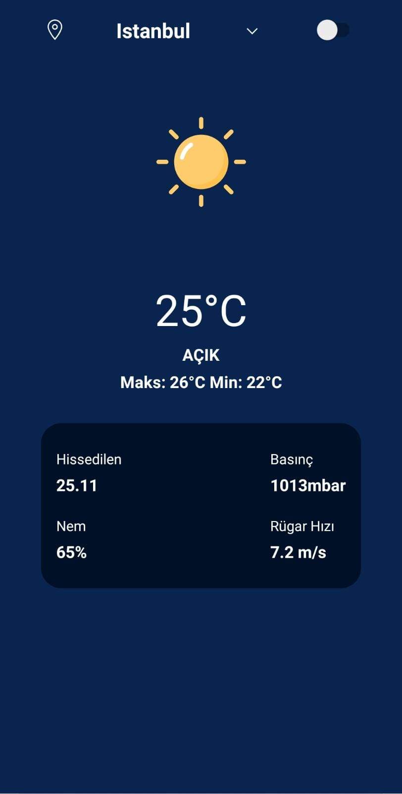
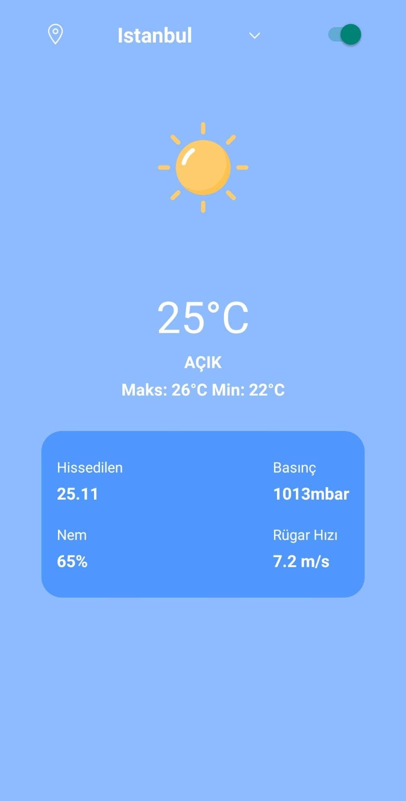
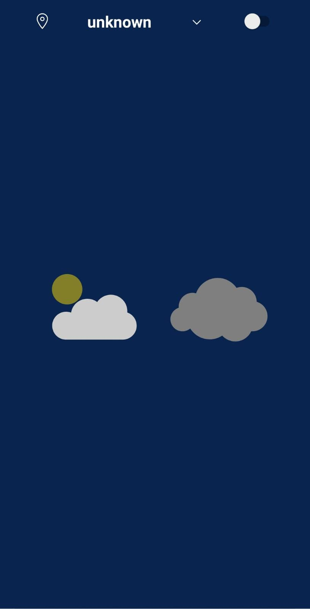
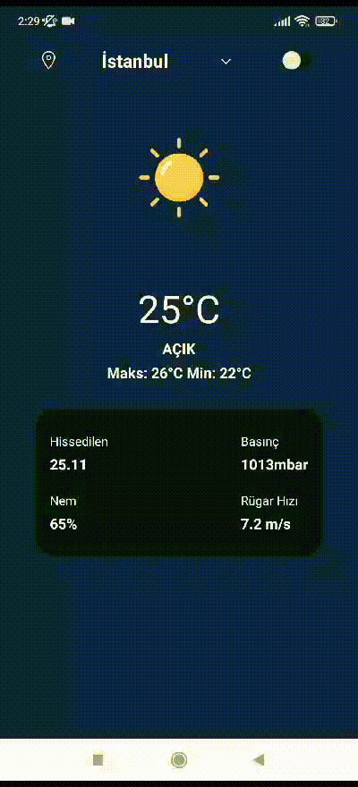

# Weather Project

## Overview

Welcome to **Weather App**, your go-to React Native solution for staying informed about the weather conditions in style. With Weather App, you can effortlessly access real-time weather updates while experiencing a seamless blend of functionality and aesthetics.

## Project Preview

<div style="display: flex; flex-direction: row; justify-content: center;">
  <div style="display: flex; flex-direction: row; margin-right: 20;">
    
    
  </div>
  
  <div style="display: flex; flex-direction: row; margin-right: 20px;"> 
    
     
  </div>
  </div>

## Design Notice

The design is personally crafted, presenting a minimalistic layout for the weather application.
I executed a straightforward design approach, highlighting essential weather information.

## Features

-Display real-time weather information based on the user's input city.
-Utilize an external weather API to fetch up-to-date weather data.
-Show appropriate weather icons or animations based on the current weather conditions.
-Implement a theme switching functionality to enhance user experience.
-Incorporate Lottie animations to add engaging visual elements to the app.

## Technologies Used

This weather application is developed using the following technologies and features:

- React Native: A widely-used JavaScript framework for building cross-platform mobile applications.
- OpenWeather API: Integrated to fetch current weather data for the specified city.
- Lottie Animations: Used to enhance the user interface with captivating animations.
- Theme Switching: Implemented the ability to switch between different app themes for personalization.
- Dynamic Icon Rendering: Display weather-specific icons to provide visual cues about the weather conditions.
- User Input Handling: Gather user-provided city names and use them to fetch relevant weather data.

## Getting Started

To run this project locally, follow these steps:

1. **Clone the repository:**

   ```bash
   git clone https://github.com/AtakanAlkn/Weather-ReactNative.git


   ```

2. **Navigate to the project directory:**

   cd Weather-ReactNative.git

3. **Install dependencies:**

   npm install
   or
   yarn install

4. **Start the development server:**

   npm start
   or
   yarn start

5. **Run on iOS or Android:**

   To run the app on iOS or Android simulators/emulators, use the following commands respectively:

   npm run ios
   npm run android
   or
   yarn ios
   yarn android

**Congratulations!**
You've successfully set up and started the project locally. Feel free to explore the code, make changes, and test new features.

**Troubleshooting**
If you encounter any issues during the setup process or while running the app, consider the following steps:

Double-check that you've correctly configured your environment variables in the .env file.
Ensure you have Node.js and npm (or yarn) installed on your system.
Make sure you have Xcode (for iOS development) or Android Studio (for Android development) properly set up.
Clear the npm or yarn cache and node_modules directory, then run the installation step again.
If the problem persists, please open an issue on our GitHub repository. We'll be glad to assist you!

## License

This repository is licensed under the [MIT License](LICENSE).

## Contact

If you have any questions, suggestions, or just want to connect, you can reach me at:

- Email: alkan.atakan@outlook.com
- LinkedIn: [Atakan Alkan](https://www.linkedin.com/in/atakanalkn/)
